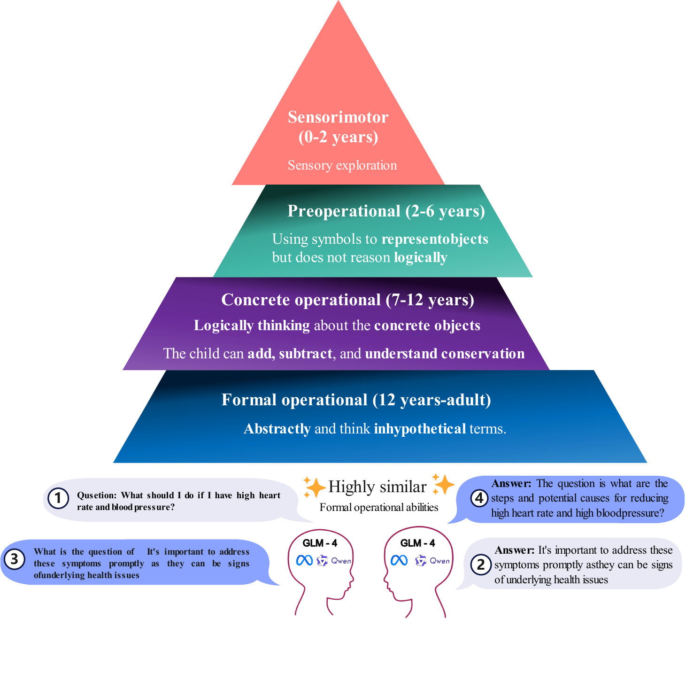
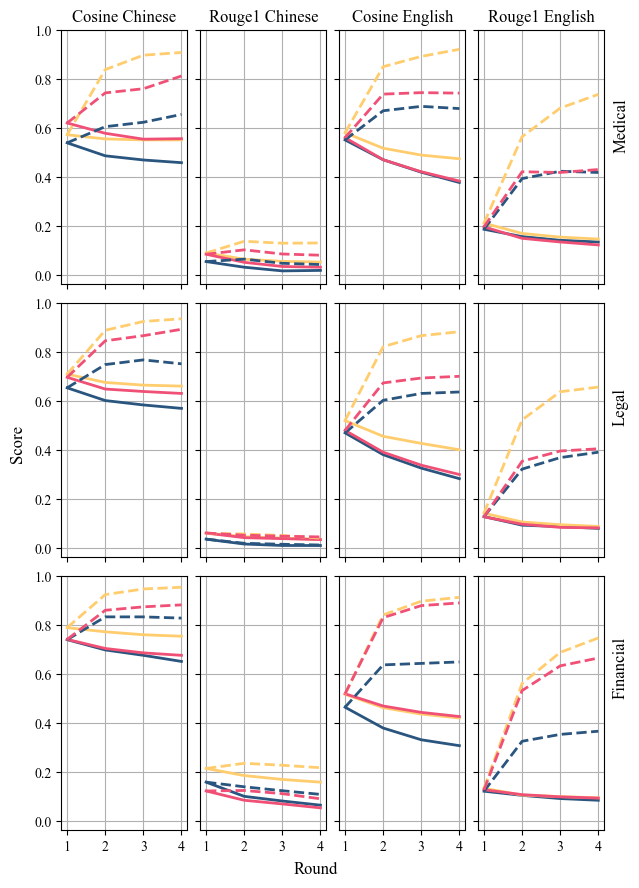
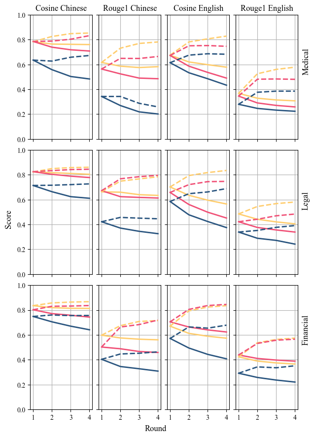

# RBLU

Reverse Bilingual Language Understanding (RBLU): A benchmark to evaluate the reverse inference ability of
large language models

<!-- PROJECT SHIELDS -->

<!-- [![Contributors][contributors-shield]][contributors-url]
[![Forks][forks-shield]][forks-url]
[![Stargazers][stars-shield]][stars-url]
[![Issues][issues-shield]][issues-url]
[![MIT License][license-shield]][license-url]
[![LinkedIn][linkedin-shield]][linkedin-url] -->


<!-- PROJECT LOGO -->
<br />

<p align="center">
  <a href="https://github.com/haowei2000/RBLU/">
    
  </a>

  <h3 align="center">The reverse inference process of RBLU benchmark</h3>
  <p align="left">
    Input the question to get the answer, and then input the answer to get the question. Finally, calculate the similarity of the input question and the output question
    <br />
    <a href="https://github.com/haowei2000/RBLU"><strong>Explore the doc »</strong></a>
    <br />
    <br />
    <a href="https://github.com/haowei2000/RBLU">View Demo</a>
    ·
    <a href="https://github.com/haowei2000/RBLU/issues">Report Bug</a>
    ·
    <a href="https://github.com/haowei2000/RBLU/issues">Request Feature</a>
  </p>

</p>

 
## Content

- [Built With](#Built-With)
- [About The Project](#About-The-Project)
  - [Dependencies](#Dependencies)
  - [Installation](#Installation)
- [Project Tree](#Project-Tree)
- [Usage](#Usage)
- [Roadmap](#Roadmap)
- [Author](#Author)
- [Acknowledgments](#Acknowledgments)


## Build With
* [![PyTorch][PyTorch]][PyTorch-url]
* [![Hugging Face][HuggingFace]][HuggingFace-url]
* [![Poetry][Poetry]][Poetry-url]
* [![Python][Python]][Python-url]

[PyTorch]: https://img.shields.io/badge/PyTorch-EE4C2C?style=flat-square&logo=PyTorch&logoColor=white
[PyTorch-url]: https://pytorch.org/
[HuggingFace]: https://img.shields.io/badge/Hugging%20Face-FFD700?style=flat-square&logo=Hugging-Face&logoColor=black
[HuggingFace-url]: https://huggingface.co/
[Poetry]: https://img.shields.io/badge/Poetry-60A5FA?style=flat-square&logo=Poetry&logoColor=white
[Poetry-url]: https://python-poetry.org/
[Python]: https://img.shields.io/badge/Python-3776AB?style=flat-square&logo=Python&logoColor=white
[Python-url]: https://www.python.org/


## Getting Start


### Dependencies

- `accelerate` = "^0.34.2"
- `datasets` = "^3.0.0"
- `evaluate` = "^0.4.3"
- `matplotlib` = "^3.9.2"
- `pandas` = "^2.2.2"
- `python` = "^3.12"
- `rouge-chinese` = "^1.0.3"
- `rouge-score` = "^0.1.2"
- `transformers` = "^4.44.2"
- `sentence-transformers` = "^3.1.0"
- `jieba` = "^0.42.1"
- `wandb` = "^0.18.0"
- `tiktoken` = "^0.7.0"
- `pyecharts` = "^2.0.6"
- `seaborn` = "^0.13.2"
- `plotly` = "^5.24.1"

### **Installation**

1. install [poetry](https://python-poetry.org/)
2. Clone the repo
3. Installing dependencies with poetry
```sh
poetry install
```

## Project Tree
eg:

```
RBLU 
├── LICENSE.txt
├── README.md
├── /figure/
├── /src/
│  ├── /chart/
│  ├── /data/
│  ├── /result/
│  ├── /score/
│  ├── /rblu/
│  │  ├── config.yaml
│  │  └── main.py
│  │  └── dataload.py
│  │  └── evaluation.py
│  │  └── metric.py
│  │  └── process.py
│  │  └── path.py
│  │  └── proxy.py
└── /tests/

```

## Usage
You can find the result for our paper in [result](https://github.com/534602988/llm_evaluation/blob/main/src/result), [score](https://github.com/534602988/llm_evaluation/blob/main/src/score), [chart](https://github.com/534602988/llm_evaluation/blob/main/src/chart).
You can re-run the project by the following command：
```sh
poetry run eval
```
Or re-draw the chart by:
```sh
poetry run draw --suffix png
```

## Roadmap

We tested three open source models, [LLAMA3.1-8BInstruct](https://github.com/facebookresearch/llama), [GLM4-9B-Chat](https://github.com/THUDM/GLM), and [Qwen2-7B-Instruct](https://github.com/QwenLM/Qwen) on the RBLU benchmark with [ROUGE](https://arxiv.org/abs/2010.12495) and [BERT-Score](https://openreview.net/forum?id=SkeHuCVFDr), the results are as follows:

<p align="center">

| **Language** | **Domain**   | **Model Name** | **Rouge1** | **Rouge2** | **RougeL** | **RougeLsum** | **BERT score** |
|--------------|--------------|----------------|------------|------------|------------|---------------|----------------|
| **English**  | Financial    | GLM4           | **0.1322** | **0.0251** | **0.0929** | **0.1047**    | 0.5161         |
|              |              | LLAMA3.1       | 0.1200     | 0.0212     | 0.0817     | 0.0970        | 0.4632         |
|              |              | Qwen2          | 0.1260     | 0.0217     | 0.0878     | 0.1005        | **0.5181**     |
|              | Legal        | GLM4           | **0.1409** | **0.0320** | **0.0930** | **0.1052**    | **0.5194**     |
|              |              | LLAMA3.1       | 0.1271     | 0.0258     | 0.0827     | 0.0978        | 0.4686         |
|              |              | Qwen2          | 0.1255     | 0.0203     | 0.0814     | 0.0964        | 0.4792         |
|              | Medical      | GLM4           | **0.2115** | 0.0718     | **0.1588** | **0.1600**    | **0.5799**     |
|              |              | LLAMA3.1       | 0.1865     | 0.0652     | 0.1428     | 0.1452        | 0.5512         |
|              |              | Qwen2          | 0.1962     | **0.0740** | 0.1509     | 0.1509        | 0.5600         |
| **Chinese**  | Financial    | GLM4           | **0.2131** | **0.0604** | **0.2120** | **0.2121**    | **0.7878**     |
|              |              | LLAMA3.1       | 0.1566     | 0.0482     | 0.1555     | 0.1551        | 0.7386         |
|              |              | Qwen2          | 0.1210     | 0.0295     | 0.1218     | 0.1215        | 0.7398         |
|              | Legal        | GLM4           | **0.0587** | **0.0108** | **0.0587** | **0.0584**    | **0.7090**     |
|              |              | LLAMA3.1       | 0.0355     | 0.0109     | 0.0349     | 0.0364        | 0.6527         |
|              |              | Qwen2          | 0.0605     | 0.0088     | 0.0612     | 0.0615        | 0.6957         |
|              | Medical      | GLM4           | **0.0893** | **0.0214** | 0.0880     | **0.0890**    | 0.5723         |
|              |              | LLAMA3.1       | 0.0540     | 0.0111     | 0.0552     | 0.0542        | 0.5390         |
|              |              | Qwen2          | 0.0843     | 0.0195     | **0.0841** | 0.0843        | **0.6198**     |

### Similarity Scores in Multi-rounds

The right side indicates 3 domains, and the top side indicates 2 score types and 2 languages. "Cosine" represents "BERT-Score", the cosine similarity of vectorized answer texts, while "Rouge1" is the corresponding Rouge-1 score. The datasets are in English and Chinese. In the legend, "Original" indicates $\text{Score}_{\text{Original}}$, and "Previous" indicates $\text{Score}_{\text{Previous}}$. The x-axis of each subplot shows the number of rounds (1–4), and the y-axis shows similarity scores (0.0–1.0).

<p align="center">
  
</p>
<p align="center">
  
  
</p>
<p align="center">
  <span style="margin-right: 20%;">Questions</span>
  <span>Answers</span>
</p>


### Some insights

</p>

- **GLM4 Performance**: GLM4 demonstrates the strongest reverse inference performance among the models tested.
  
- **Semantic vs. Syntactic**: LLMs generally capture semantic meaning more effectively than syntactic structure.

- **Cognitive Inertia**: LLMs exhibit cognitive inertia, as they tend to generate increasingly similar questions over multiple rounds.

- **Forward vs. Reverse Inference**: LLMs show stronger forward inference capabilities than reverse inference.

- **Language Differences**:
  - **Chinese**: Due to the flexibility of expressions and varied word choices in Chinese, the outputs display greater semantic flexibility.
  - **English**: English outputs maintain higher syntactic consistency due to the stricter syntactic rules in the language.


## Author

[Haowei Wang](mailto:wanghw00@gmail.com)

[AlexLiu](https://github.com/MAXIMUM950814)

## License
This project is licensed under the MIT License. For more details, please refer to [LICENSE.txt](https://github.com/haowei2000/RBLU/blob/master/LICENSE.txt)

## Acknowledgments

- [GitHub Pages](https://pages.github.com)
- [isort](https://pycqa.github.io/isort/)
- [ruff](https://beta.ruff.rs/docs/)


<!-- links -->
[your-project-path]:haowei2000/RBLU
[contributors-shield]: https://img.shields.io/github/contributors/haowei2000/RBLU.svg?style=flat-square
[contributors-url]: https://github.com/haowei2000/RBLU/graphs/contributors
[forks-shield]: https://img.shields.io/github/forks/haowei2000/RBLU.svg?style=flat-square
[forks-url]: https://github.com/haowei2000/RBLU/network/members
[stars-shield]: https://img.shields.io/github/stars/haowei2000/RBLU.svg?style=flat-square
[stars-url]: https://github.com/haowei2000/RBLU/stargazers
[issues-shield]: https://img.shields.io/github/issues/haowei2000/RBLU.svg?style=flat-square
[issues-url]: https://img.shields.io/github/issues/haowei2000/RBLU.svg
[license-shield]: https://img.shields.io/github/license/haowei2000/RBLU.svg?style=flat-square
[license-url]: https://github.com/haowei2000/RBLU/blob/master/LICENSE.txt
[linkedin-shield]: https://img.shields.io/badge/-LinkedIn-black.svg?style=flat-square&logo=linkedin&colorB=555
[linkedin-url]: https://linkedin.com/in/shaojintian


